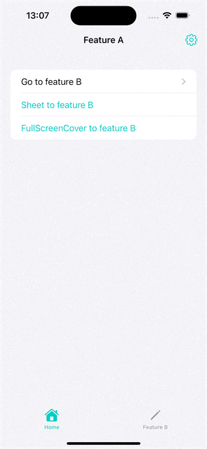

<picture>
  <source media="(prefers-color-scheme: dark)" srcset="https://github.com/user-attachments/assets/c629b97b-ca4b-428f-8147-e6846a30bc40">
  
</picture>

# Navigate

[](https://github.com/apple/swift-package-manager)

Simple navigation for SwiftUI

## Overview
Navigate is a Swift navigation library that enables high-level modularization using `NavigationDestination` protocol. It introduces `ModalStack`, which works exactly like SwiftUI `NavigationStack` and allows you to display multiple **Sheets** and **FullScreenCovers** on top of each other.



### Define your destinations
Define your possible destinations in a higher level package in one or more enums.

```swift
import Navigate

enum MyDestination: NavigationDestination {
    case featureA
    case featureB
    case featureC
    case featureD
    case settings
    case profile
    
    var id: Self { self }
}
```

#### Convenience
To be able to write shortenings for your custom destinations, convenience initializers are necessary. These code can be copied from below and adopted accordingly.

```swift
extension NavigationLink where Destination == Never {
    
    /// NavigationLink init for `Navigate` framework
    /// - Parameters:
    ///   - destination: The `NavigationDestination` to navigate to
    ///   - label: The label for the `NavigationLink`
    init(destination: MyDestination, @ViewBuilder label: @escaping () -> Label) {
        self.init(value: destination, label: label)
    }
}

extension SheetLink {
    /// NavigationLink init for `Navigate` framework
    /// - Parameters:
    ///   - destination: The `NavigationDestination` to navigate to
    ///   - label: The label for the `NavigationLink`
    init(destination: MyDestination, @ViewBuilder label: @escaping () -> Label) {
        self.init(destination: destination as any NavigationDestination, label: label)
    }
}

extension FullScreenCoverLink {
    /// NavigationLink init for `Navigate` framework
    /// - Parameters:
    ///   - destination: The `NavigationDestination` to navigate to
    ///   - label: The label for the `NavigationLink`
    init(destination: MyDestination, @ViewBuilder label: @escaping () -> Label) {
        self.init(destination: destination as any NavigationDestination, label: label)
    }
}
```

### ModalStack
#### Definition
Those `MyDestination`s need to be applied to the first element within a `ModalStack` similar to SwiftUI's `NavigationStack`.

```swift
@State var modalPath: [ModalPathDestination] = []

var body: some View {
    ModalStack(path: $modalPath) {
        List {
            SheetLink(destination: .featureB) {
                Text("Sheet to feature B")
            }
        }
        .myModalDestinations() // register all modal destinations
    }
}
```

#### Register destinations

For better code organization and maintainability, use a dedicated view to handle destination resolution:

```swift
import Navigate
import SwiftUI

struct ResolvedDestinationView: View {
    let destination: MyDestination
    
    var body: some View {
        switch destination {
        case .featureA:
            FeatureAView()
        case .featureB:
            FeatureBView()
        case .featureC:
            FeatureCView()
        case .featureD:
            FeatureDView()
        case .settings:
            SettingsView()
        case .profile:
            ProfileView()
        }
    }
}

extension View {
    /// SwiftUI navigation destination convenience
    func myNavigtationDestinations() -> some View {
        self.navigationDestination(for: MyDestination.self) { destination in
            ResolvedDestinationView(destination: destination)
        }
    }
    
    /// All ModalDestinations wrapped in NavigationStack to support SwiftUI navigation and toolbar
    func myModalDestinations() -> some View {
        self.modalDestination(for: MyDestination.self) { destination in
            NavigationStack {
                ResolvedDestinationView(destination: destination)
                    .myNavigtationDestinations()
            }
        }
    }
}

```

## Available SwiftUI links
Use the `NavigationLink`, `SheetLink` and `FullScreenCoverLink`

```swift
List {
    NavigationLink(destination: .featureB) {
        Text("Go to feature B")
    }

    SheetLink(destination: .featureB) {
        Text("Sheet to feature B")
    }

    FullScreenCoverLink(destination: .featureB) {
        Text("FullScreenCover to feature B")
    }
}
```
